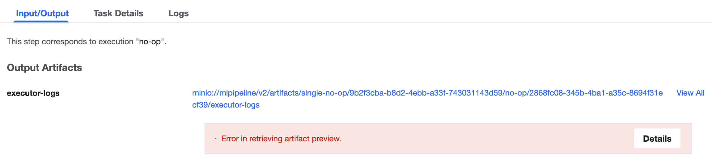
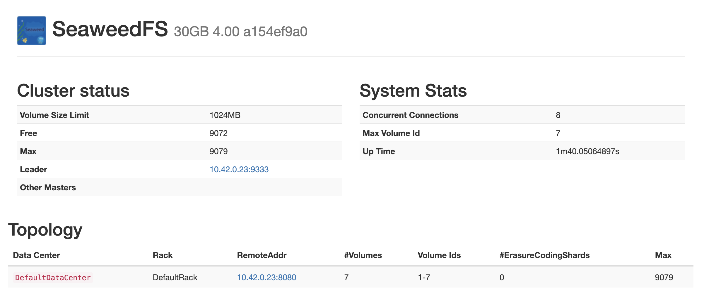

# SeaweedFS Host Path

These steps are intended to show how you can get **persistent SeaweedFS data when using some single node deployments of Kubeflow**. This is largely motivated by the desire to use the Kubeflow SeaweedFS deployment as a substitute for S3 or other object stores in data pipelines. Because I often delete development clusters (`kind`, `colima`, etc) when not using them, the associated data can easily be lost too.

This kustomization modifies the SeaweedFS deployment to use a host volume so the underlying data is persisted in a known and re-useable location. This has been tested on MacOS using `colima` which works due to the default mounting parts of the host disk into the VM LiMA is running.

> Note: This is intended for use with the SeaweedFS `base/` deployment (see [here](https://github.com/kubeflow/pipelines/tree/ab7e60779bad1b8419690c9c1ee792355b4669a1/manifests/kustomize/third-party/seaweedfs/base)) since this is the configuration advised for [standalone KFP deployment guides](https://www.kubeflow.org/docs/components/pipelines/operator-guides/installation/#deploying-kubeflow-pipelines): [platform-agnostic](https://github.com/kubeflow/pipelines/blob/ab7e60779bad1b8419690c9c1ee792355b4669a1/manifests/kustomize/env/platform-agnostic/kustomization.yaml#L8) manifests and the [dev](https://github.com/kubeflow/pipelines/blob/ab7e60779bad1b8419690c9c1ee792355b4669a1/manifests/kustomize/env/dev/kustomization.yaml#L8) which use the `platform-agnostic` pattern too.

The following will remove the default volume of the deployment and replace it with a host volume at the path specified by `SEAWEEDFS_HOST_PATH`.

```bash
export PIPELINE_VERSION=2.15.0
export SEAWEEDFS_HOST_PATH="$HOME/kf_seaweedfs"

# TODO: Better way than this templated version?
envsubst < template.kustomization.yml > kustomization.yml
kubectl apply -k .
```

**IMPORTANT NOTE** This will make all existing data in the `seaweedfs-pvc` **INACCESSIBLE** it will still exist until this previous PVC is deleted, but will cause errors such as those seen below.

> *Note:* I assume this `minio://` protocol will be replaced sometime in the future.



## Getting a weed shell outside the cluster

Here we are going to use `kubectl port-forward` to allow ingress from `weed shell` into the the K8 cluster. SeaweedFS is intended to allow distributed deployments and as such will open a number of TCP connections to different processes / nodes. At least in version `4.00` this means that after the initial connection to a "master" it will find a single "leader" and open a connection to that. We can check out the UI to see the current leader.

> Note you can see a full list of ports [here](https://github.com/seaweedfs/seaweedfs/blob/7c7b673fc148b34239b9f814039d0abbd6aa9b5e/docker/Dockerfile.go_build#L24-L39).

```bash
kubectl -n kubeflow port-forward service/seaweedfs 9333:9333
```

Navigating to [http://localhost:9333/](http://localhost:9333/) we will see something like the following:



This form of IP represents an issue for us as `10.42.0.23` is a cluster IP and will not be available to our host if it is advertised as the leader. So we make a modification to the deployment to advertise `localhost` instead. The deployment is running `weed server` so we can use two options from `weed server -help`.

```bash
  -ip string
        ip or server name, also used as identifier (default "192.168.86.27")
  -ip.bind string
        ip address to bind to. If empty, default to same as -ip option.
```

We tell the server to advertise itself as `localhost` while still binding to all addresses `0.0.0.0`. Without the second option, at the very least one problem will occur: the K8s readiness probe will fail.

```yml
spec:
    containers:
       - args:
            - server
            - -dir=/data
            - -s3
            - -iam
            - -filer
            - -master.volumePreallocate=false
            - -ip=localhost
            - -ip.bind=0.0.0.0
```

If we still have the `9333` port from previously we can check [http://localhost:9333/](http://localhost:9333/) again and it should now advertise `localhost:9333`.

Another fun part is that even though the master port is listed as `9333` if you try to start a shell outside the cluster right now via `weed -v=1 shell` or similar, you will see the following error.

> Note: The `-v=1` enables verbose logging.

```bash
master: localhost:9333 filer:
I1127 18:58:04.731994 masterclient.go:376 .adminShell masterClient bootstraps with masters {[localhost:9333] <nil>}
I1127 18:58:04.732015 masterclient.go:166 .adminShell masterClient Connecting to master localhost:9333
I1127 18:58:04.733924 masterclient.go:174 .adminShell masterClient failed to keep connected to localhost:9333: rpc error: code = Unavailable desc = connection error: desc = "transport: Error while dialing: dial tcp [::1]:19333: connect: connection refused"
```

This is because even if we specify `weed shell -master localhost:9333`, it will not actually open any connection to `localhost:9333` but instead try's to open a connection to the GRPC master port `19333` instead, fun! So we need some additional port forwards:

```bash
kubectl -n kubeflow port-forward service/seaweedfs 19333:19333
kubectl -n kubeflow port-forward service/seaweedfs 18888:18888
```

The second of these is for the "filer server" which is needed for many (if not all) shell commands. After those of these `kubectl port-forward` commands are active, you can start a shell outside the cluster and it will work!

```bash
weed shell
> s3.bucket.list
  mlpipeline	size:0	chunk:0
```

And if you want, you can close the `9333` port-forward, it is not needed for the shell connection as far as I can tell.

Through some limited testing with KFP, the altered configuration does not seem to affect artifact pushing (only confirmed on the executor log files). This may be because whatever mechanism is pushing these artifacts is not relying on the IP reported by the SeaweedFS server.

Does not seem to be effecting:
1. New artifact push
1. Existing artifact retrieval

## Using the Kubeflow SeaweedFS deployment as an unintended S3 replacement

Now that we have a `weed shell`, we can use it to create additional buckets besdies the `mlpipeline` one used by Kubeflow Pipelines. For example to create a bucket called `my-bucket` we can use the following command:

```
> s3.bucket.create --name my-bucket
create bucket under /buckets
created bucket my-bucket
```

We can see that there are now two buckets:

```
> s3.bucket.list
  mlpipeline	size:0	chunk:0
  my-bucket	size:0	chunk:0
```

Now we can write objects such as pandas DataFrames to this S3-like bucket. Inside of this cluster this can be done simply with:

```python
import pandas as pd

STORAGE_OPTIONS = {
    'endpoint_url': 'http://seaweedfs.kubeflow.svc.cluster.local:8333',
    'key': os.environ["S3_ACCESS_KEY"],
    'secret': os.environ["S3_SECRET_KEY"],
}

df = pd.DataFrame({'a': [1, 2, 3], 'b': [4, 5, 8]})
df.to_parquet(
    's3://my-bucket/dummy_kfp.parquet',
    storage_options=STORAGE_OPTIONS
)
```

The pipeline in `scripts/kfp_usage.py` shows how to use this with [kfp-kubernetes](https://kfp-kubernetes.readthedocs.io/en/kfp-kubernetes-2.15.2/) secret loading to pull the access key and secret out of Kubernetes.

You can also write objects outside of the DataFrame if you port forward the S3 service port:

```bash
kubectl -n kubeflow port-forward service/seaweedfs 8333:8333
```

After export the default secrets as environment variables and installing some dependencies you will be able to run the sample `push.py` and `pull.py` scripts

```bash
export S3_ACCESS_KEY=minio
export S3_SECRET_KEY=minio123

python -m pip install pandas pyarrow fsspec s3fs

python scripts/push.py
python scripts/pull.py
```

Back inside the `weed shell` we can see that both of these have been written:

```
> fs.ls buckets/my-bucket
dummy.parquet
dummy_kfp.parquet
```

## References / Notes
- [K8 Host Path](https://kubernetes.io/docs/concepts/storage/volumes/#hostpath)
- SeaweedFS
    - [The wiki](https://github.com/seaweedfs/seaweedfs/wiki) is the best source of information.
- [KFP SeaweedFS deployment](https://github.com/kubeflow/pipelines/blob/master/manifests/kustomize/third-party/seaweedfs/base/seaweedfs/seaweedfs-deployment.yaml)
    - Idk why we don't use the [operator](https://github.com/seaweedfs/seaweedfs-operator).
- Kustomize
    - Env vars
        - Maybe okay to do a `envsubst` before a `kubectl apply -f -` for some things but not for stuff in the `resources` which the kustomize needs to build the manifests before application.
        - No stdin in kustomize: https://github.com/kubernetes-sigs/kustomize/issues/2985
    - Not totally sure why I need a selector on the `kubeflow` namespace in both the root of the kustomization and in the patch section.
